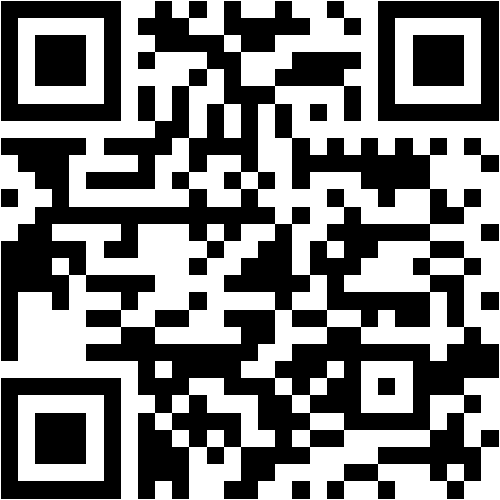

# 手話 → 音声変換アプリ

スマートフォンのカメラで手の形を認識し、あらかじめ登録しておいた読み上げテキストを音声で再生するWebアプリです。ブラウザで動作し、ホーム画面に追加すればアプリのように使えます（PWA）。

## 公開URL

**https://jibikaasanori97-ops.github.io/sign-to-voice/**

スマホのカメラでこのQRコードを読み取ると開けます。



## できること

- カメラ映像から両手（最大2つ）のランドマークをリアルタイム検出（MediaPipe Hand Landmarker）
- 好きな手の形・動きと読み上げテキストのペアを自分で登録（学習型・辞書は空の状態からスタート、片手/両手どちらも可）
- 登録済みの形に近い手の形を検出したら自動で音声読み上げ
- 認識結果を文章としてためて、まとめて読み上げることも可能
- 📷ボタンで前面（自分側）/背面（相手側）カメラを切り替え可能
- 読み上げ音声・話す速さを端末にインストールされている音声から選択可能

## なぜ「あ・い・う…」の指文字が最初から入っていないのか

日本手話の指文字や単語の手の形は、画像で正確に確認しないと誤った形を「正解」として登録してしまう恐れがあります。誤った手話の情報を広めることは避けたいため、あらかじめ辞書を埋め込まず、利用者自身（またはJSLの参考資料）が正しい手の形を見せて登録する方式を基本にしました。登録後は何度でも編集・削除できます。

### 指文字プリセット（実験的・11文字のみ）

トップ画面の「指文字プリセット（実験的・11文字）」から、あ・い・う・せ・て・け・か・き・し・そ・つ の11文字だけ、ルールベースの認識をオンにできます（[app.js](app.js)ではなく[presets.js](presets.js)に実装）。これは以下2つの解説サイトの**文章による形状説明**を突き合わせ、記述が一致し、かつ他の文字と形が衝突しにくいものだけを選んだものです（プリセットはすべて片手のみ対応）。

- [指文字[あ行～な行]【みんなの知識 ちょっと便利帳】](https://www.benricho.org/yubimoji/01.html)
- [手話の指文字-50音一覧を表現する方法- | SureTalk](https://www.suretalk.mb.softbank.jp/column/contents/000106.php)

**重要な注意点**:
- 画像・映像そのものを見て確認したものではなく、文章記述から起こしたルールです。実際に使う前に、信頼できる別の資料や、手話に詳しい方に確認することを強くおすすめします。
- 「し」と「す」、「う」と「と・な・に」、「あ」と「く・さ・た」のように、指の本数パターンは同じで手の向き（手のひら/手の甲がどちらを向いているか）だけで区別される文字は、誤認識・混同を避けるためプリセットから意図的に外しています。
- この11文字以外、あるいはプリセットの精度に満足できない場合は、上記の「サインを登録する」機能でご自身の手の形を直接登録することをおすすめします（そちらの方が実際の使用環境・使用者に合わせられるぶん確実です。日常的によく使う単語も、まずはこの方法で自分の言葉として登録するのが最も確実です）。

もし実在するJSLの指文字・単語セットをさらに追加したい場合は、参考にする画像や動画（書籍、公式サイトのスクリーンショット等）を教えてください。それをもとに追加のルールを作成します。

## 使い方

1. 下記の「動かし方」でアプリをスマホのブラウザで開く
2. カメラへのアクセスを許可する
3. 「サインを登録する」を開き、読み上げテキスト（例：こんにちは）を入力
4. サインの種類を選ぶ
   - 静止：手の形をキープするサイン（指文字など）
   - 動き：手を動かすサイン（払う・振る等）。ボタンを押してから2秒間、実際に動かしながら手話を行う
5. 「登録」ボタンを押して手の形・動きをキャプチャする
6. 同じ言葉を数回（3〜5回）登録すると認識精度が上がる
7. 手話を行うと自動で認識され、テキスト欄に追加されつつ読み上げられる
8. 「静止サインの感度」「動きサインの感度」スライダーで誤認識・未認識のバランスを調整できる（値が小さいほど厳密に一致させる）

## 動かし方（重要：カメラ利用にはHTTPS接続が必要）

スマホのブラウザでカメラを使うには、`https://` または `localhost` からアプリを開く必要があります。以下のいずれかの方法で用意してください。

### 方法A: 無料のホスティングサービスを使う（おすすめ・一番簡単）

1. このフォルダ（`手話音声変換アプリ`）の中身を GitHub のリポジトリにアップロードし、GitHub Pages を有効化する
   もしくは
2. Netlify や Vercel など、フォルダをドラッグ＆ドロップするだけでHTTPS URLが発行されるサービスを使う

発行されたURLをスマホのブラウザで開けばOKです。

### 方法B: PCでローカルサーバーを立てて試す（PC単体での動作確認用）

```
python -m http.server 8000
```

PCのブラウザで `http://localhost:8000` を開けば動作確認できます（`localhost` は特別扱いなのでHTTPS不要）。ただしスマホから同じPCにWi-Fi経由でアクセスする場合は `http://<PCのIPアドレス>:8000` はセキュアな接続と見なされずカメラが使えないため、スマホ実機での確認には方法Aが必要です。

## 読み上げ音声について

「読み上げ音声の設定」から、端末にインストールされている音声（Web Speech APIで取得できるもの）を選んで、話す速さも調整できます。音声そのものの自然さはOS・ブラウザ側の実装に依存するため、アプリ側でできるのは「一番自然に聞こえる音声を選べるようにする」ところまでです。

- iOS: 設定 → アクセシビリティ → 読み上げコンテンツ → 声 で、高品質な「拡張版」音声を追加ダウンロードできます
- Android: 設定 → システム → 言語と入力 → テキスト読み上げの出力 で、Google音声合成エンジンの言語データを最新版に更新すると自然になる場合があります

より人間らしい声にしたい場合は、クラウドの神経音声合成API（例: Google Cloud Text-to-Speech、Amazon Polly等）と連携する方法もありますが、APIキーの取得や利用料金が発生するため、必要であれば別途対応します。

## 制限事項・今後の拡張案

- 認識は「登録した手の形・動きとの近さ」による簡易的な方式です。人が変わる・照明が変わると精度が落ちることがあるため、実際に使う人・環境で登録し直すことをおすすめします。
- 動きサインは「開始から終了までの手首の移動」と「各時点の手の形」を組み合わせて比較する簡易的な方式です。複雑な軌跡（円を描く等）や高速な動きは誤認識しやすいので、感度スライダーで調整してください。動きサインの軌跡は、検出できている方の手（両手とも映っている場合は片方）の動きを基準にしています。
- 指文字プリセットは片手のみ対応です（もともと片手で表現する文字のため）。
- オフラインで動かしたい場合は、MediaPipeのモデル・WASMファイルをこのフォルダ内にダウンロードして相対パスに差し替えることで対応できます。

## バージョン履歴

- v3: 両手のサインに対応（左右の手を結合した特徴量で登録・認識）。カメラ切替（自分/相手）、読み上げ音声の選択・速さ調整、指文字プリセットの拡充（7→11文字）、動きサイン登録中に映像が固まって見える問題の修正。保存フォーマット変更のため、v2以前で登録したサインは引き継がれません（再登録してください）。
- v2: 動き（軌跡）を伴う手話に対応。保存フォーマット変更のため、v1で登録したサインは引き継がれません（再登録してください）。
